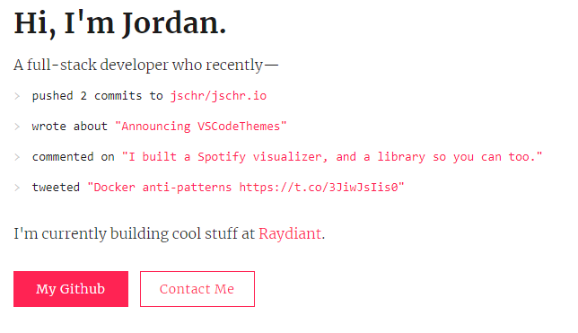
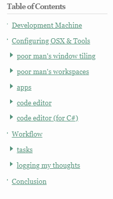
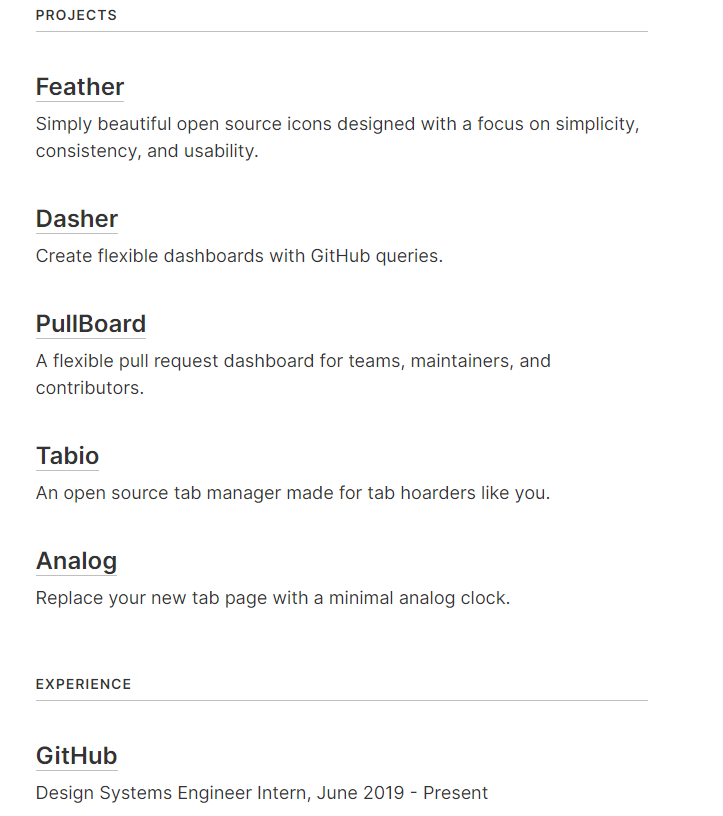
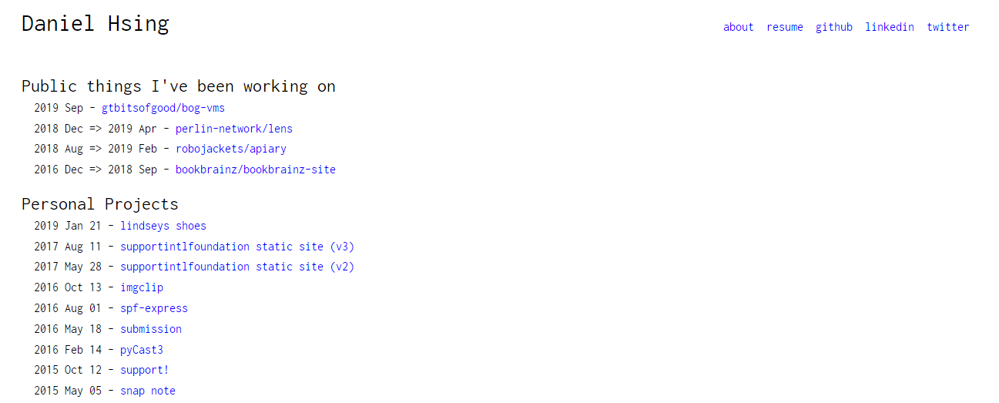
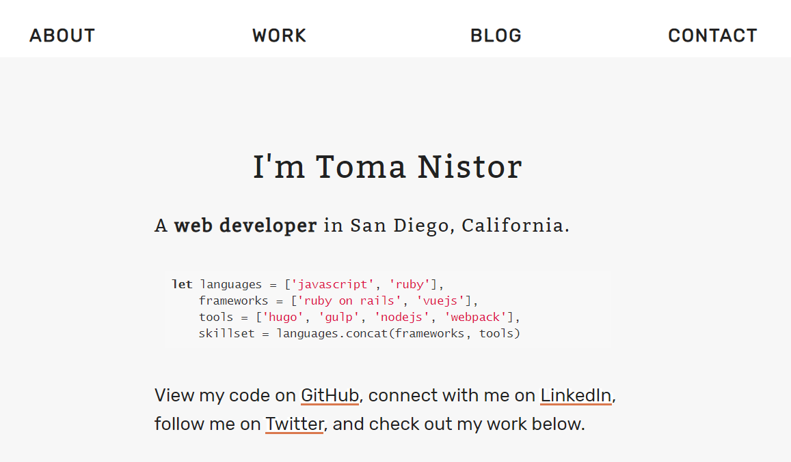
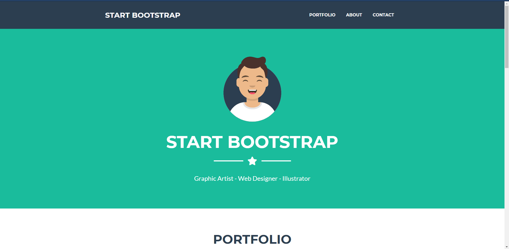
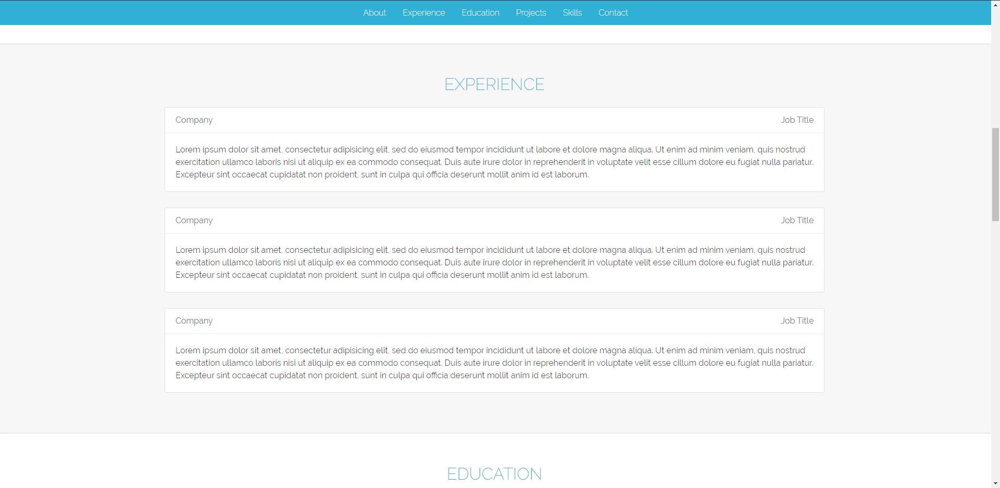
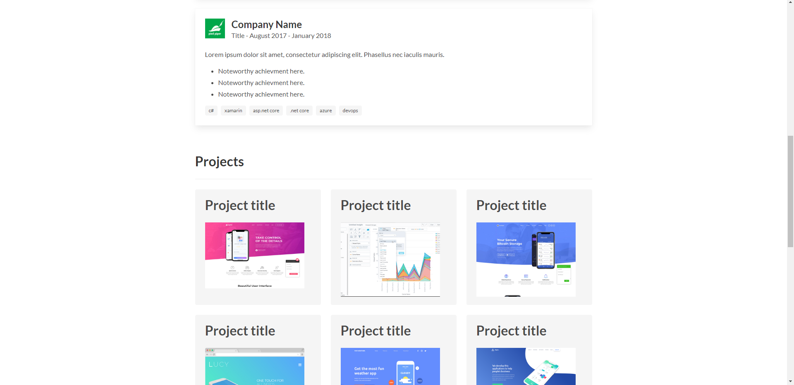
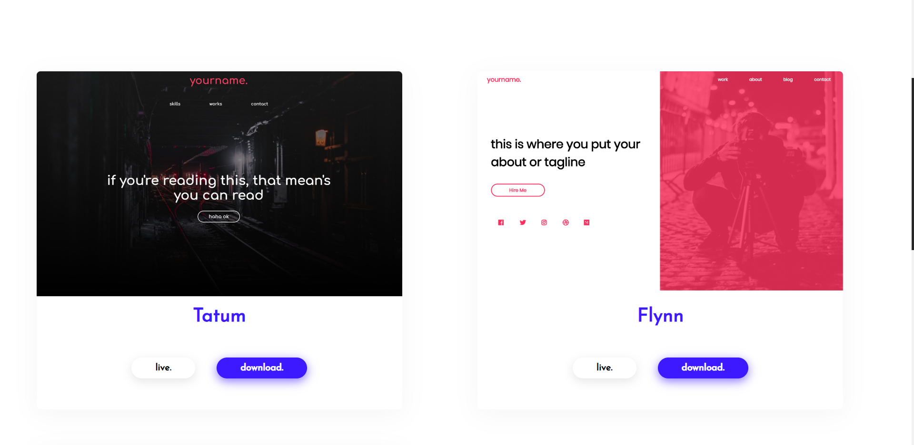

# awesome-lists
My personal lists for everything and anything

# Table of Content
* [Portfolios](#portfolios) - my list of web portfolios that I think are awesome.
* [Blogs](#blogs) - a list of my favorite blogs that I like to read.

# Portfolios
My list of web-portfolios that I think are awesome. Pull requests are welcome.

## Resources
* https://www.reddit.com/r/web_design/comments/6glc6i/best_ridiculously_simple_portfolio_sites/

## https://www.justinchi.me/

## https://jschr.io/

## https://andrewzah.com/posts/my-setup-remote-programming-osx-2019/#development-machine

* I really like the table of contents as the sidebar here

## https://colebemis.com/

* interesting way of formatting all sections like a list

## https://arthelon.github.io/

* another simple list type format

## https://tomanistor.com/

* cool black and white color scheme
* also cool blog format

## https://blackrockdigital.github.io/startbootstrap-freelancer/
* simple, clean look

## https://bmorelli25.github.io/portfolio-template/
* I like the use of the bootstrap cards.
* https://github.com/bmorelli25/portfolio-template

## https://mmacneil.github.io/devfolio/
* use of bootstrap cards to display education and employment
* use of smaller image cards that display a modal of information about projects

## https://imfunniee.github.io/fimbo/
* great visuals
* 100% free to use

# Blogs
