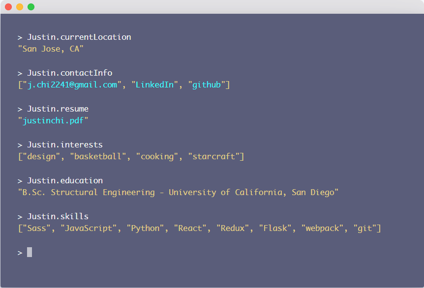

# awesome-lists
My personal lists for everything and anything

# Table of Content
* [Portfolios](#portfolios) - my list of web portfolios that I think are awesome.
* [Blogs](#blogs) - a list of my favorite blogs that I like to read.
* [Web Development Resources](#web-development-resources)


# Portfolios
My list of web-portfolios that I think are awesome. Pull requests are welcome.

## Resources
* https://www.reddit.com/r/web_design/comments/6glc6i/best_ridiculously_simple_portfolio_sites/

## https://www.justinchi.me/


## https://jschr.io/


## https://andrewzah.com/posts/my-setup-remote-programming-osx-2019/#development-machine

* I really like the table of contents as the sidebar here


## https://colebemis.com/

* interesting way of formatting all sections like a list


## https://arthelon.github.io/

* another simple list type format


## https://tomanistor.com/

* cool black and white color scheme
* also cool blog format


## https://blackrockdigital.github.io/startbootstrap-freelancer/
* simple, clean look


## https://bmorelli25.github.io/portfolio-template/
* I like the use of the bootstrap cards.
* https://github.com/bmorelli25/portfolio-template


## https://mmacneil.github.io/devfolio/
* use of bootstrap cards to display education and employment
* use of smaller image cards that display a modal of information about projects


## https://imfunniee.github.io/fimbo/
* great visuals
* 100% free to use


[Back to top](#table-of-content)

# Blogs
## https://markdotto.com/
This blog is written by one of the creators of [Bootstrap](https://github.com/twbs/bootstrap). He provides some quick advice, and has a sense of humor which is refreshing.

## https://www.vanschneider.com/blog

# Web Development Resources

I got this idea this [site](https://webdevresources.info/colors).

## Colors
* [Granim.js](https://github.com/sarcadass/granim.js): Create fluid and interactive gradient animations with this small javascript library.
* [Color Hunt](https://colorhunt.co/): Color Palettes for Designers and Artists
* [Color Claim](https://www.vanschneider.com/colors): Created Tobias van Schneider with the goal to collect & combine unique colors for future projects.

## CSS
* [Bootstrap Table](https://github.com/wenzhixin/bootstrap-table): An extended table to integration with some of the most widely used CSS frameworks.
* [Animate CSS](https://github.com/daneden/animate.css): A cross-browser library of CSS animations
* [Text Input Effects](https://tympanus.net/Development/TextInputEffects/index.html): Simple ideas for enhancing text input interactions
* [Hamburgers](https://github.com/jonsuh/hamburgers): Tasty CSS-animated hamburgers
* [CSS Effects Snippets](https://github.com/emilkowalski/css-effects-snippets): A collection of CSS effects made with Vue.js
* [Skeleton](http://getskeleton.com/): A dead simple, responsive boilerplate.

## JavaScript
* [Flatpickr](https://github.com/flatpickr/flatpickr): lightweight, powerful javascript datetimepicker with no dependencies
* [Select2](https://github.com/select2/select2): The jQuery replacement for select boxes.
* [Prism](https://prismjs.com/): front-end syntax highlighter
* [Cleave.js](https://github.com/nosir/cleave.js): Format your ```<input/>``` content when you are typing.
* [jQuery Cheat Sheet](https://websitesetup.org/wp-content/uploads/2017/01/wsu-jquery-cheat-sheet.pdf)

## Icons
* [Boxicons](https://boxicons.com/): High Quality web friendly icons 
* [Devicon](https://github.com/konpa/devicon/): Set of icons representing programming languages, designing & development tools
* [Ion Icons](https://github.com/ionic-team/ionicons): The premium icon font for Ionic Framework and web apps everywhere

## HTML
* [HTML character codes](https://www.rapidtables.com/web/html/html-codes.html): All HTML character codes of text fonts and symbols from &#0; to &#65535


