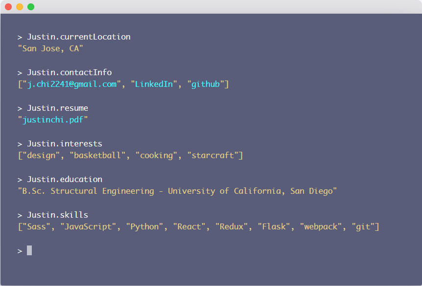
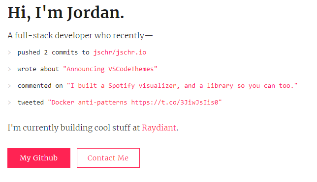
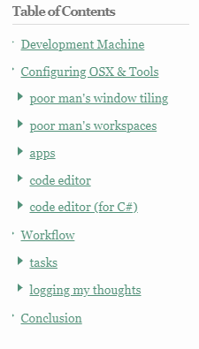
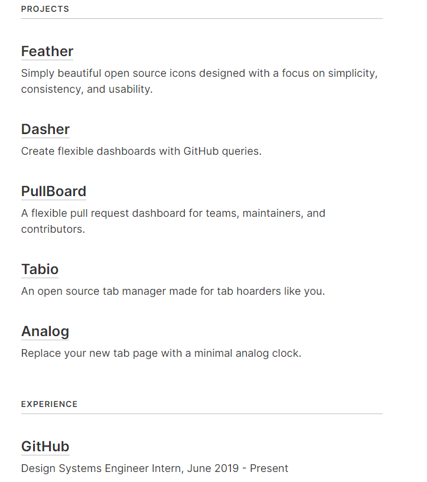
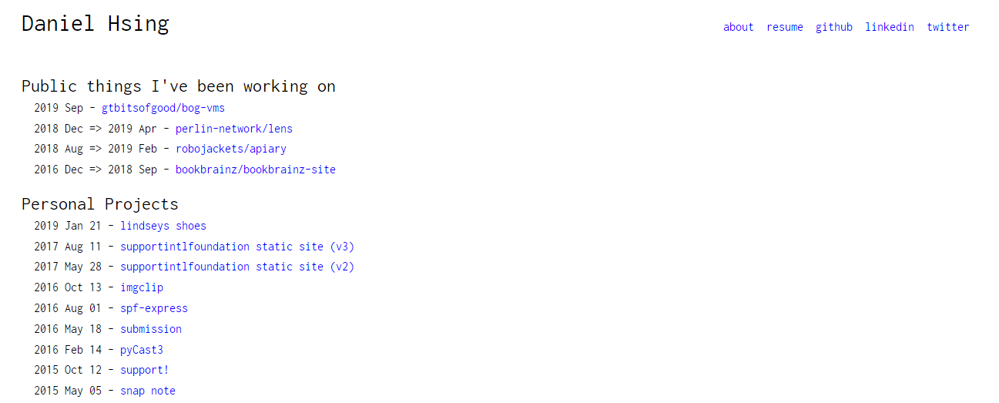
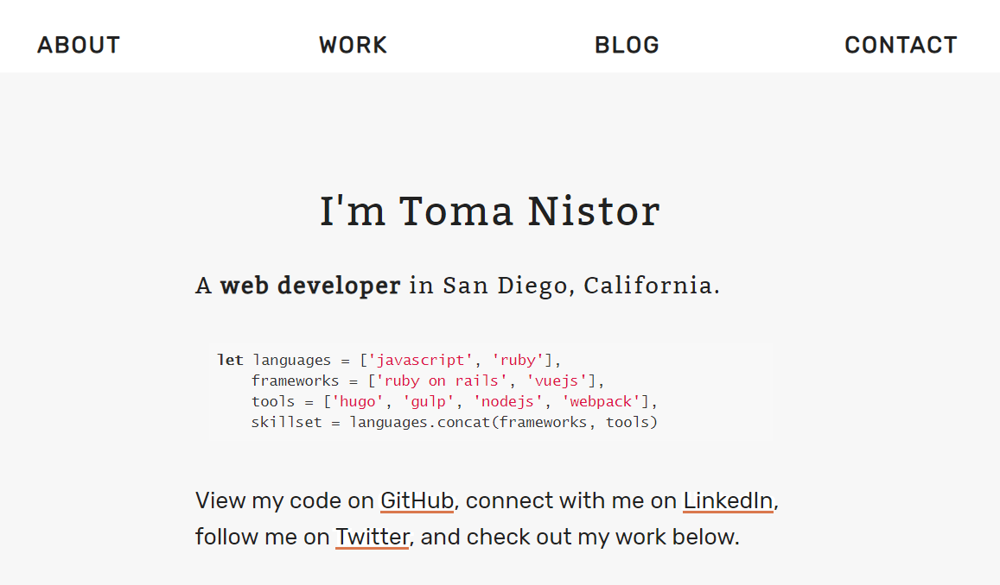
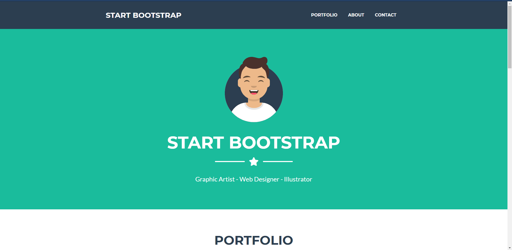
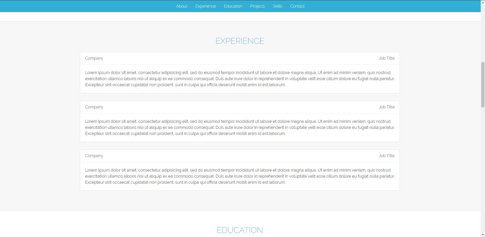
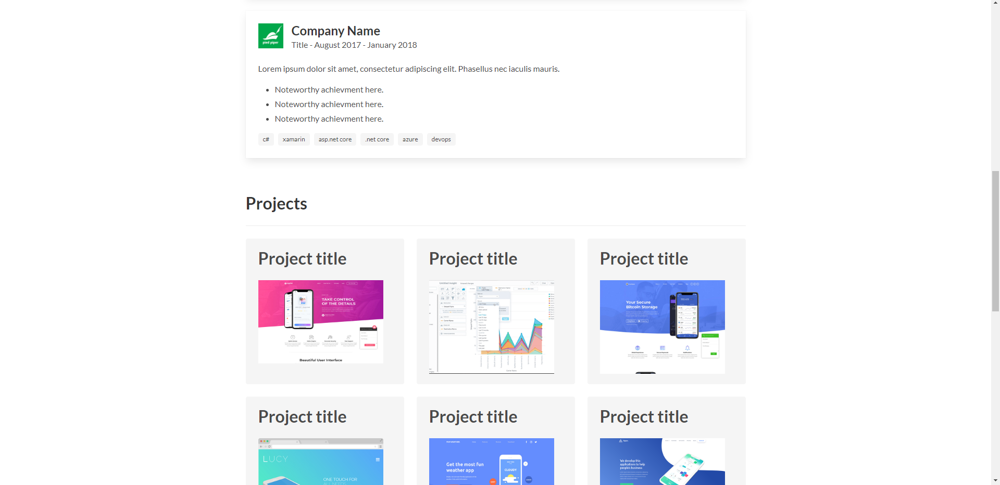
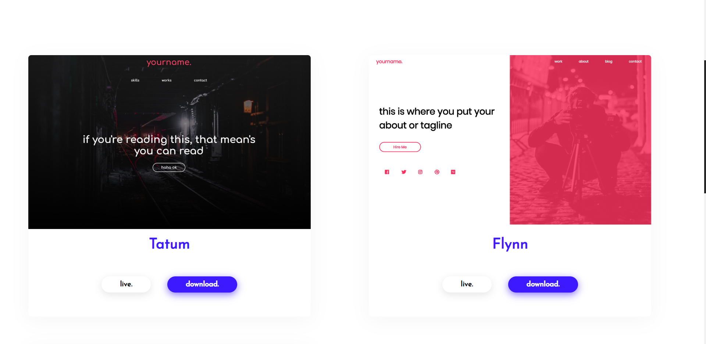

# Portfolios

## Resources
* https://www.reddit.com/r/web_design/comments/6glc6i/best_ridiculously_simple_portfolio_sites/

## 1. https://www.justinchi.me/

## 2. https://jschr.io/

## 3. https://andrewzah.com/posts/my-setup-remote-programming-osx-2019/#development-machine
* I really like the table of contents as the sidebar here

## 4. https://pedak.me/
* very simple design, yet looks very good

## 5. https://colebemis.com/
* interesting way of formatting all sections like a list

## 6. https://arthelon.github.io/
* another simple list type format

## 7. https://tomanistor.com/
* cool black and white color scheme
* also cool blog format

## 8. https://blackrockdigital.github.io/startbootstrap-freelancer/
* simple, clean look

## 9. https://bmorelli25.github.io/portfolio-template/
* I like the use of the bootstrap cards.
* https://github.com/bmorelli25/portfolio-template

## 10. https://mmacneil.github.io/devfolio/
* use of bootstrap cards to display education and employment
* use of smaller image cards that display a modal of information about projects

## 11. https://imfunniee.github.io/fimbo/
* great visuals
* 100% free to use

<!-- eof -->
